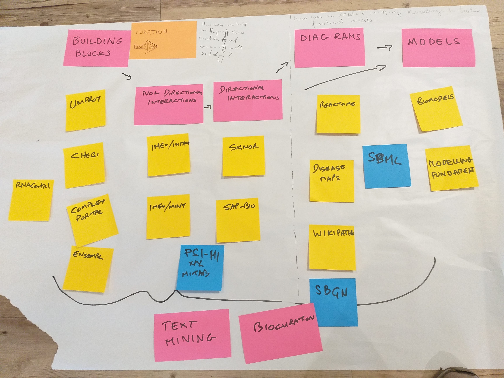
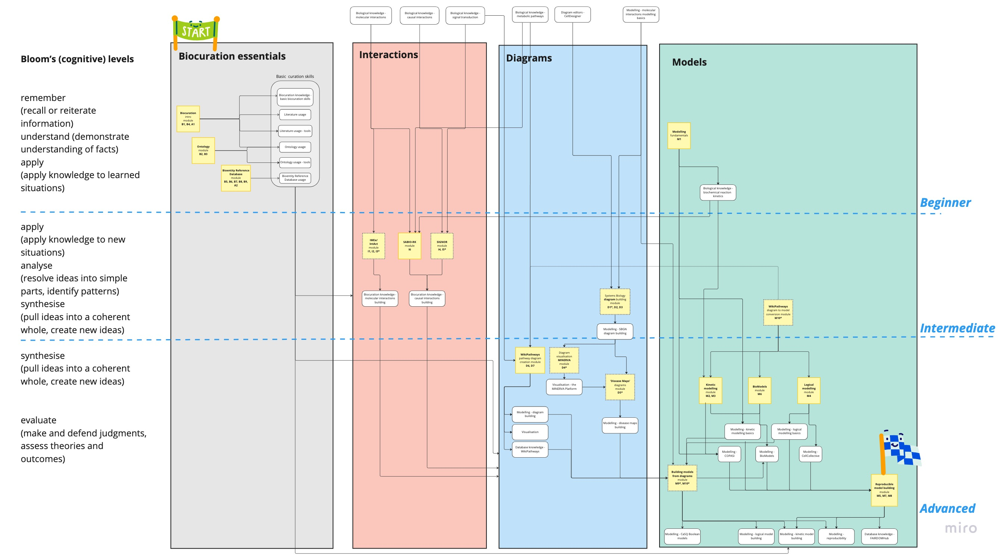

# Introduction

As part of the one week Biohackathon 2022 in Paris, France, we formed
a team to map out and connect training resources for biocuration/modelling in systems biology into a [learning path](https://en.wikipedia.org/wiki/Learning_pathway). We built on the experience of the [BioHackathon 2021 Project 9](https://github.com/elixir-europe/bioHackathon-projects-2021/tree/main/projects/9). The motivation for this work was the fact that modelling of biological systems in an accurate and reproducible way requires a set of diverse competences. To train systems biologists, we need a map of training resources to acquire these necessary competences in a correct sequence.

# Approach

Based on the [Learning Path protocol](https://en.wikipedia.org/wiki/Learning_pathway) we prepared a minimal information template, including prerequisites and learning outcomes, to harmonise training resources. Then we planned our work into the following activities:

1. Retrieval of systems biology and biocuration traning materials in four Areas: biocuration essentials, curation of molecular interactions (Interactions), creation of systems biology diagrams (Diagrams) and construction of reproducible models (Modelling). 
    1. Expert search of available and related training material;
    2. Query of [TeSS training materials](https://tess.elixir-europe.org/materials) for keywords: `systems` or `curation`;
2. Review collected materials to harmonise prerequisites and learning outcomes.
    1. Develop a controlled vocabulary (CV) based on the collected information
    2. Project the collected materials on a matrix of Areas vs Cognitive levels ([Learning Path protocol](https://en.wikipedia.org/wiki/Learning_pathway)) 
3. Connect the training resources by matching prerequisites and learning outcomes
    1. Construct a diagram of training resources
    2. Identify gaps and propose an integrated learning  path.

# Results

## Harmonised training resources

The Learning Path (LP) protocol suggests positioning training resources according their thematic area (X axis) and the difficulty level of the training, according to Bloom's cognitive taxonomy[@anderson2001taxonomy] (Y axis). We have identified 33 training resources (including 7 gaps, see below), which we have manually mapped on a draft LP structure (Figure \ref{fig1}). 



The draft map was transformed into a [Miro board](https://miro.com/app/board/uXjVPKxZaJo=/) with training resources grouped into modules, according to their similar prerequisites and learning outcomes. Competences (prerequisites and learning outcomes) are separate nodes on the Miro board, allowing to define a starting point based on a learner's background (Figure \ref{fig2}).



## Controlled vocabulary

Our controlled vocabulary (CV) can be found on a shared [Google document](https://docs.google.com/document/d/1eGuxfFpqO-Uu4R8-uo00VITRxJ80V37Jz-vXuW--vEs/edit). Our customized CV is partially hierarchical, but needs to be curated into a persistent resource, following a more refined structure. One suggestion is to establish a smiple grammar following a three-word syntax:
```
[Bloom taxonomy term] - [Ontology topic] - [list of relevant URIs]
e.g.
[Understand] - [Ontology concept ID] - [http://geneontology.org]
```
The above document also contains a summary table of all 33 training resources collected to create the Miro board {fig2}.

## Mapping to the TeSS workflow

We set up a [TeSS workflow](https://tess.elixir-europe.org/workflows/building-interoperable-and-reusable-systems-biology-models) linking the reviewed training resources together. All the resources, except the gaps, were mapped to TeSS training materials (Figure \ref{fig3}). Missing materials are indicated.


## Summary and outlook

The following tasks were accomplished as part of the BioHackathon:

\begin{enumerate}
\item Review systems biology training resources
\item Construct a CV of learning outcomes and harmonise them across the resources
\item Construct a Learning Path out of the reviewed materials
\end{enumerate}

For future work, the group will work to complete the training resources mapping, clarify the connections and persist the outcomes.

Future work includes:

- Finalise this report and aim for a peer reviewed publication
- Persist the CV following a proposed strategy in [@cox2021faircv]
- Collaborate with ELIXIR Training Platform for [TrainingMaterials BioSchema profile](https://bioschemas.org/profiles/TrainingMaterial/1.0-RELEASE) to provide CV-related info directly on training websites

# Discussion

Our mapping allowed us to demonstrate the need of training in a range of topics which are required for creating reproducible systems biology models. Importantly, understanding of the basics of biocuration, including refence databases, ontologies and proper work with the literature are indispensible as foundations for modelling.

Discuss also:
- Identified gaps
- Model building is associated with higher oerder Bloom taxonomy terms
- Perspectives for managing the mapping, updating training materials etc.

## Acknowledgements

We thank the organizers of the ELIXIR BioHackathon 2022 for travel support for some of the authors.

## References
